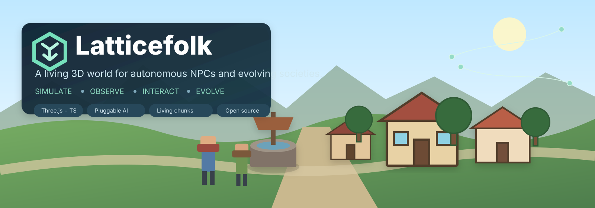

# Latticefolk

<p align="center"></p>

<p align="center"><strong>Una simulación web 3D de código abierto para NPC autónomos, sociedades y mundos en evolución.</strong></p>

<p align="center"><a href="../README.md">English</a> · <a href="README.zh-CN.md">简体中文</a> · <a href="README.ja.md">日本語</a> · <b>Español</b></p>

Latticefolk no pretende ser solo una demostración de NPC que conversan. Los habitantes trabajan, recolectan, fabrican, comercian, entregan objetos, sacan agua, patrullan, visitan, descansan, duermen y exploran; esas decisiones modifican inventarios, economía, relaciones y el estado del mundo. Las regiones lejanas siguen simulándose como chunks de baja resolución y también pueden recibir decisiones de política regional.

El proyecto **no está acoplado a Jev**. Jev / TypeSafe System One es el primer adaptador remoto, mientras el núcleo usa el contrato genérico `DecisionProvider`.

## Funciones actuales

- Pueblo 3D con Three.js, primera persona y God View como observador externo.
- Unas 20 acciones acotadas para NPC.
- Sistema unificado `WorldObject + capabilities` para edificios, pozo, mercado, almacenamiento, carros, árboles, rocas, flores y herramientas.
- Fallback determinista y provider Jev opcional.
- Simulación gruesa de chunks lejanos con población, recursos, ecología, prosperidad y decisiones por lotes.
- Persistencia SQLite para chunks, NPC/objetos visitados, progreso del jugador, hora y clima entre reinicios.
- Flujos conservados entre chunks: migración, alimentos, madera, agua y ecología se transfieren con origen, destino y cantidad explícitos.
- decisiones jerárquicas Region / World: a mayor escala, menor frecuencia; el modelo solo elige políticas acotadas.
- streaming dinámico de chunks: la exploración en primera persona expande el mundo, la ventana activa permanece acotada y los chunks descubiertos persisten; God View no genera terreno.
- asentamientos procedurales semánticos: bioma, política, peligro y prosperidad generan caminos, edificios funcionales, zonas de trabajo, recursos y residentes; el contenido generado sigue siendo interactivo.
- ecología de fauna persistente: conejos, ciervos, jabalíes y zorros existen como poblaciones coarse e individuos fine, con capacidad del hábitat, migración, necesidades, depredación/huida, decisiones Jev por lotes, reproducción, herencia y persistencia.
- Presupuesto de tokens/coste de Jev administrable desde God View.
- Diálogo escrito previamente con recuperación local y selección de líneas o fragmentos.
- UI y corpus en chino simplificado, inglés, japonés y español.
- Recursos low-poly CC0 de Quaternius.
- Archivo genealógico duradero y observabilidad evolutiva: los ancestros sobreviven a la muerte y descarga del chunk en SQLite; se distinguen fundadores de nacimientos reproductivos y se miden causas de muerte, descendencia, éxito reproductivo y medias/varianzas/tendencias de rasgos por generación en God View.
- Evidencia de presión selectiva por bioma: el linaje conserva el hábitat de origen/muerte y God View muestra diferencias normalizadas entre reproductores y cohorte, consistencia entre generaciones y tamaño de muestra sin presentar correlación como causalidad.
- Exposición de hábitat durante la vida observada: solo se acumula mientras el individuo existe en simulación fine, con medias ambientales ponderadas por tiempo, duración por bioma/chunk y transiciones observadas; los intervalos coarse no se inventan como historia individual y God View compara bioma de origen con bioma dominante observado.
- Migración fine con identidad persistente: los individuos nombrados solo pueden migrar a chunks adyacentes legales y conservan entity ID, padres, generación, traits, embarazo e historial de hábitat; la simulación determinista controla capacidad de carga, conservación coarse, peso representativo, tránsito persistente y provenance.
- Competencia de nicho determinista: perfiles fijos de recursos para conejo/ciervo/jabalí/zorro producen solapamiento de nicho por pares y, junto con la densidad de otras especies, presión competitiva; esta reduce de forma acotada la capacidad efectiva, afecta la salud y se observa en God View y lineage habitat exposure.
- Migración estacional: una idoneidad species×biome para primavera/verano/otoño/invierno se combina con forage, agua, ecología y peligro; un hábitat adyacente al menos 8 puntos mejor puede impulsar por sí solo un flujo migratorio conservado de baja amplitud, y la fauna fine solo usa este valor dentro de candidatos legales.
- Transmisión de enfermedades más rica: coarse separa presión ambiental, contacto intraespecífico, contacto entre especies e importación por migración; la fauna fine transmite según vecinos reales, distancia y coeficientes fijos entre especies, y God View/lineage exposure conservan la presión observada.
- Evidencia fitness-by-habitat: relaciona exposición vital a competencia, idoneidad estacional, presión de enfermedad y predator pressure con reproducción, descendencia y longevidad; los juveniles vivos quedan censurados a la derecha para resultados reproductivos hasta alcanzar la adultez, mientras las muertes juveniles permanecen como resultados completos sin reproducción. Las muestras insuficientes o sin varianza se muestran como no estimables, no como correlación cero; God View muestra cohortes baja/media/alta, breeder rate y diferencias de rasgos sin afirmar causalidad.
- Observabilidad de predator pressure: la densidad real de depredadores y la preferencia compartida de presas producen una presión 0–100 por especie; solo entra en God View, lineage lifetime exposure y fitness evidence, sin aplicar daño o pérdida de población adicionales. La mortalidad real sigue siendo resultado exclusivo de la depredación determinista.
- Evidencia predator/prey specialization: coarse conserva la descomposición predator→prey de la presión y el lineage fine acumula presión media ponderada por cada fuente depredadora solo durante periodos realmente observados. El historial antiguo sin datos de fuente permanece desconocido, no se convierte en cero; God View muestra asociaciones por fuente con reproducción, descendencia, longevidad y breeder trait differential.
- Evidencia de hunting/escape realizado: solo la resolución determinista de acciones fine registra hunt attempt/hit/kill, flee attempt/success y attack received/survived, también separados por counterpart species. El Decision Provider solo elige hunt/flee y objetivos legales; no puede declarar éxito. God View muestra tasas de impacto, muerte, escape y supervivencia al ataque junto con diferencias de rasgos de individuos exitosos.
- predator/prey trait matching: los individuos que realmente interactúan registran deltas actor−counterpart de rasgos; predator separa attempt/hit/kill y prey separa flee attempt/escape y attack/survival. Los paired-snapshot counts son independientes, por lo que los realized outcomes antiguos sin trait snapshot no se convierten en cero ni diluyen los promedios nuevos. God View también muestra tasas reales y ventajas de rasgos por generaciones recientes.
- multi-generation coevolution evidence: cada pair predator→prey real conserva series generacionales independientes para predator y prey; no se supone que el mismo número de generación entre especies sea un cohort sincronizado. Cada lado relaciona realized performance, breeder rate de individuos elegibles, offspring mean, trait mean y ventajas reales de rasgos. Las correlaciones requieren al menos 3 puntos generacionales útiles y las tendencias al menos 2; evidencia insuficiente o sin varianza permanece no estimable y no se declara coevolución automáticamente.
- multi-species interaction network: integra predation, niche competition simétrica y cross-species disease transmission dirigida en una red ecológica de solo lectura. Cada tipo mantiene su propio coverage; un chunk antiguo sin pair decomposition completa permanece desconocido, no se interpreta como cero. God View agrega solo el bounded active window y `/api/world/interactions` agrega los discovered chunks persistidos; la red no modifica population, health ni candidatos de decisión.
- network-linked niche / disease source evidence: el lineage fine acumula solo durante periodos observados la competition pressure de cada counterpart species y la disease pressure entrante de cada source species. Ambas familias mantienen su propio denominador de observed-days; datos antiguos sin pair decomposition permanecen desconocidos. God View y evolution stats aplican right-censoring y muestran asociaciones con reproduction / offspring / lifespan y breeder trait differential sin afirmar causalidad.
- Expansión del food web: se añaden cabra y lobo y se centralizan species list, predator/prey graph, preferencia de depredación, daño y alivio de hambre como definiciones controladas por la simulación. Ambas especies participan en carrying capacity / competition / season / disease / trophic flow coarse, hunt/flee / lifecycle / migration fine y observabilidad evolutiva.

## Inicio rápido

Requiere Node.js 20+:

```bash
git clone https://github.com/wangfumin1/Latticefolk.git
cd Latticefolk
cp .env.example .env
npm install
npm run dev
```

Sin clave Jev se usa el fallback local. Para Jev, configure `TYPESAFE_API_KEY` únicamente en el servidor.

## Principio de diseño

El modelo elige **intenciones acotadas**; el simulador aplica **consecuencias legales y deterministas**. El modelo no puede inventar entidades ni modificar libremente valores del mundo.

God View también es estrictamente un observador externo y no aparece en la percepción de los NPC.

## Hoja de ruta

✅ coarse↔fine → ✅ SQLite → ✅ flujos conservados → ✅ decisiones Region / World → ✅ streaming dinámico → ✅ asentamientos procedurales semánticos → ✅ cadenas de producción → ✅ primera ecología de ciclo vital → ✅ genealogía duradera / estadísticas evolutivas → ✅ observabilidad de presión selectiva y adaptación por bioma → ✅ exposición de hábitat observada durante la vida → ✅ migración fine con identidad → ✅ competencia de nicho → ✅ movimiento estacional → ✅ transmisión de enfermedades enriquecida → ✅ fitness-by-habitat → ✅ cabra/lobo + predator graph compartido → ✅ observabilidad predator-pressure → ✅ evidencia predator/prey specialization → ✅ evidencia hunting/escape realizada → ✅ predator/prey trait matching + tendencias generacionales → ✅ evidencia de coevolución multigeneracional → ✅ observabilidad de red multiespecie → ✅ evidencia por fuente de nicho/enfermedad ligada a red → **tendencias generacionales por competencia/enfermedad + evidencia de selección recíproca** → física.

Consulta [Roadmap](roadmap.md), [Architecture](architecture.md) y [Decision providers](decision-providers.md).

## Contribución y licencia

Lee [CONTRIBUTING.md](../CONTRIBUTING.md). Código bajo [MIT](../LICENSE). Las licencias de recursos se documentan en [THIRD_PARTY_NOTICES.md](../THIRD_PARTY_NOTICES.md). Para citas, usa [CITATION.cff](../CITATION.cff).
